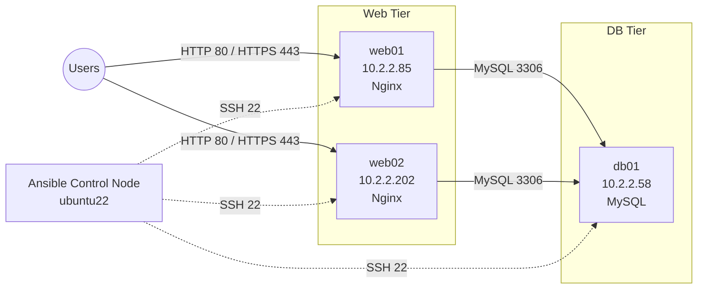

# Ansible Web & Database Infrastructure Automation

Automated provisioning of a **two-tier web infrastructure** (Nginx web servers + MySQL database server) on Ubuntu using **Ansible roles**, with **UFW firewall hardening** and **Ansible Vault** for secrets management.

One command configures every server from a clean Ubuntu install to a working, firewalled setup — and can be re-run safely at any time (idempotent).

---

## Architecture



| Host  | Group       | Role(s)              | Open ports                          |
|-------|-------------|----------------------|-------------------------------------|
| web01 | webservers  | nginx, firewall      | 22, 80, 443                         |
| web02 | webservers  | nginx, firewall      | 22, 80, 443                         |
| db01  | dbservers   | database, firewall   | 22, 3306 (**only from web servers**) |

---

## Features

- **Role-based structure**: separate, reusable `nginx`, `database` and `firewall` roles
- **Two-tier separation**: web and database servers run in separate plays and inventory groups
- **Firewall hardening with UFW**: SSH is allowed before UFW is enabled, so Ansible never locks itself out
- **Dynamic firewall rules**: MySQL access is built from the inventory, so changing a web server's IP updates the database firewall automatically
- **Secrets management**: database credentials are encrypted with Ansible Vault
- **Templated configuration**: `mysqld.cnf` and the Nginx index page are generated from Jinja2 templates
- **Idempotent**: a second run reports `changed=0`

---

## Tech Stack

| Tool          | Purpose                                     |
|---------------|---------------------------------------------|
| Ansible       | Configuration management and orchestration  |
| Nginx         | Web server                                  |
| MySQL         | Relational database                         |
| UFW           | Host-based firewall                         |
| Ansible Vault | Encryption of secrets                       |
| Jinja2        | Configuration templating                    |
| Ubuntu 22.04  | Target operating system                     |

---

## Project Structure

```
ansible-nginx-automation/
├── inventory                    # Hosts and groups
├── site.yml                     # Main playbook (web play + db play)
├── group_vars/
│   ├── all/                     # Variables for every host
│   ├── webservers/
│   │   └── vars.yml             # HTTP/HTTPS ports
│   └── dbservers/
│       ├── vars.yml             # MySQL port, allowed clients
│       └── vault.yml            # Encrypted DB credentials
└── roles/
    ├── nginx/                   # Install & configure Nginx, deploy index page
    ├── database/                # Install & configure MySQL
    └── firewall/                # Install UFW, apply per-group rules, enable
```

---

## Prerequisites

- Control node with **Ansible** installed (`ansible --version`)
- Target servers running **Ubuntu 22.04**
- An `ansible` user on every target with **SSH key access** and **passwordless sudo**
- Required collections:

```bash
ansible-galaxy collection install community.general community.mysql
```

---

## Usage

### 1. Clone the repository
```bash
git clone https://github.com/<your-username>/ansible-nginx-automation.git
cd ansible-nginx-automation
```

### 2. Update the inventory
Edit `inventory` with your own server IPs:
```ini
[webservers]
web01 ansible_host=10.2.2.85
web02 ansible_host=10.2.2.202

[dbservers]
db01 ansible_host=10.2.2.58
```

### 3. Create the vault file
```bash
ansible-vault create group_vars/dbservers/vault.yml
```
Add your secrets, for example:
```yaml
vault_mysql_root_password: "ChangeMe!"
```

### 4. Check connectivity
```bash
ansible all -i inventory -m ping
```

### 5. Dry run
```bash
ansible-playbook -i inventory site.yml --check --diff --ask-vault-pass
```

### 6. Deploy
```bash
ansible-playbook -i inventory site.yml --ask-vault-pass
```

---

## Verification

**Web servers respond:**
```bash
curl http://10.2.2.85
curl http://10.2.2.202
```

**Firewall rules are correct on every host:**
```bash
ansible all -i inventory -b -m command -a "ufw status verbose"
```

**MySQL is reachable from web servers only:**
```bash
# From web01 / web02: should succeed
nc -zv 10.2.2.58 3306

# From the control node or any other host: should time out
nc -zv 10.2.2.58 3306
```

**Idempotency** — run the playbook a second time; the recap should show `changed=0`:
```
PLAY RECAP
web01  : ok=..  changed=0  unreachable=0  failed=0
web02  : ok=..  changed=0  unreachable=0  failed=0
db01   : ok=..  changed=0  unreachable=0  failed=0
```

---

## Security Considerations

- Default UFW policy denies all incoming traffic not explicitly allowed
- MySQL port 3306 is open **only** to the web servers' IPs
- Database passwords are never stored in plain text — they live in an encrypted vault
- The vault password file (if used) is excluded from Git via `.gitignore`

---

## Future Improvements

- [ ] HTTPS with Let's Encrypt / self-signed certificates
- [ ] Nginx as a reverse proxy in front of a sample application
- [ ] CI pipeline with GitHub Actions running `ansible-lint` and `yamllint`
- [ ] Role testing with Molecule (Docker driver)
- [ ] Provision the VMs with Terraform or Vagrant
- [ ] Monitoring with Prometheus and Grafana

---

## Author

**Gourab Kumar Lodh**
Aspiring DevOps Engineer
GitHub: [@gklodh](https://github.com/gklodh) · LinkedIn: [your-profile](https://www.linkedin.com/in/your-profile)
